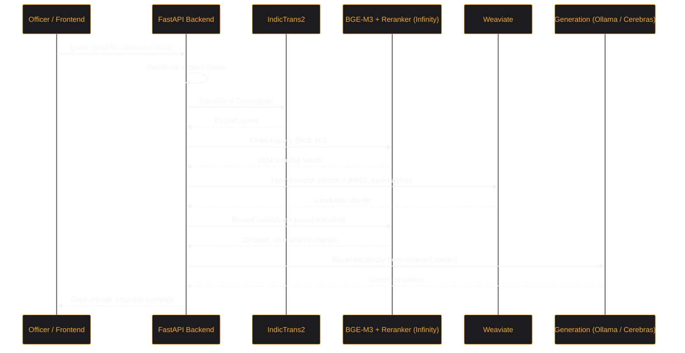
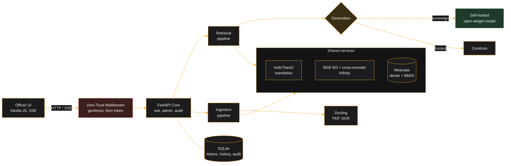
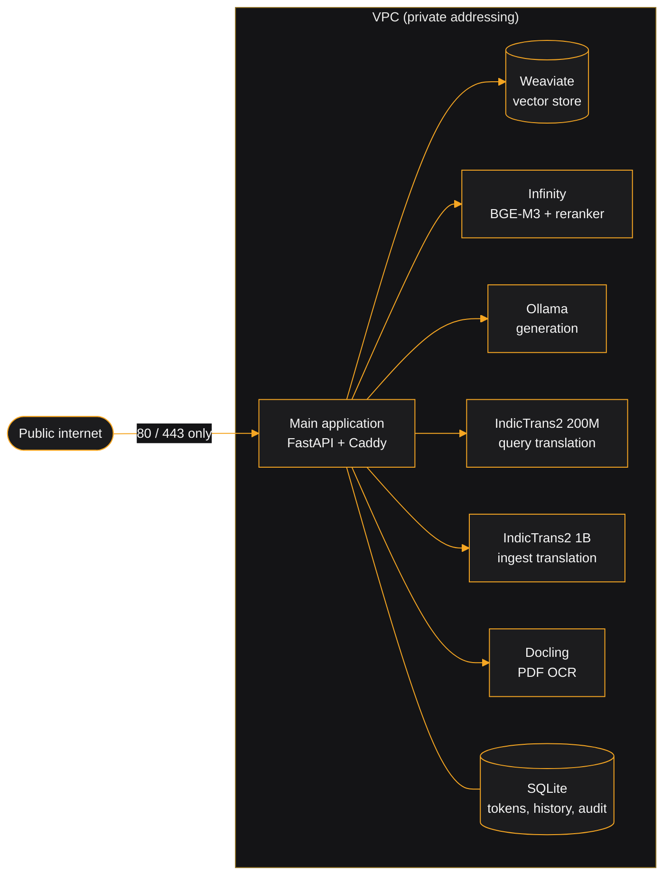
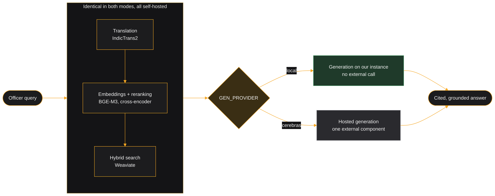

<div align="center">
  
</div>

# Mimir Engine

Mimir is an **Extensible AI-powered Retrieval-Augmented Generation (RAG) Engine** designed as the foundational backend for deploying secure, citation-backed conversational interfaces across government intranets.

Built for flexibility, Mimir separates the core AI retrieval logic from the frontend presentation layer. While the repository includes a reference implementation (an Officer Portal for the Higher & Technical Education Department, Government of Maharashtra), the engine itself is department-agnostic. Swapping the frontend stylesheet and pointing `CORPUS_COLLECTION` at a different Weaviate collection is enough to power a portal for Finance, Health, Police, or Revenue, with no backend code changes.

Named after the Norse figure who guarded the Well of Wisdom, Mimir represents the institutional memory and secure intelligence infrastructure of the modern digital government.

---

## Key Features & Capabilities

- **Runs entirely on your own hardware.** `DEPLOYMENT_MODE=sovereign` puts generation, embeddings, reranking, translation, and OCR on machines you control. Every model in that path is open-weight, so an air-gapped deployment is a configuration change rather than a rewrite.

- **Semi-Agentic RAG Pipeline**
  - **Hybrid Search**: dense vector search and BM25 keyword search, fused natively in **Weaviate**. The alpha weight is tuned per query, so GR-number lookups lean keyword-heavy while conceptual questions stay balanced.
  - **Self-Hosted Embeddings**: **BGE-M3** (1024-dimensional, multilingual) served through **Infinity**. No cloud embedding quota, no per-query embedding cost.
  - **Self-Hosted Cross-Encoder Reranking**: a **BGE reranker** scores query and candidate together on the same Infinity server. No LLM call, no token cost.
  - **Swappable Generation**: **Ollama** serving Qwen3 on your own hardware, or **Cerebras** when third-party inference is acceptable. One environment variable decides. Generation fails closed in both modes: there is no fallback to a proprietary model.

- **Multilingual by design**
  - Marathi and Hindi queries are detected and translated to English by a self-hosted **IndicTrans2** service before retrieval, so both halves of hybrid search keep working in every language against a single index.
  - Ingestion uses the larger IndicTrans2 1B model, where accuracy on legal phrasing matters more than latency.

- **Conflict and supersession awareness.** When retrieved documents disagree on an amount, age, date, or threshold, the answer opens with an explicit warning callout naming both values and which one is operative. An officer acting on a superseded figure is the specific failure this system exists to prevent.

- **Idempotent ingestion.** File-hash state tracking makes re-ingestion safe and non-duplicating. PDF extraction degrades through three tiers (PyMuPDF4LLM, then Docling or Document AI OCR, then Gemini Vision) so scanned circulars still get indexed. Chunking is table-aware and preserves a parent-child hierarchy.

- **Security and auditability**
  - **Intranet geofencing**: middleware validates the client address against `MIMIR_ALLOWED_SUBNETS` before authentication is even considered.
  - **Token identity**: no passwords. Only SHA-256 hashes are stored, compared with `hmac.compare_digest`.
  - **Access log**: logins, denials, token issuance and revocation, uploads, and feedback are recorded with actor, address, and timestamp, readable from the admin console.
  - **Upload quarantine**: documents uploaded through the admin panel land in a quarantine collection and enter the live corpus only when an administrator promotes them.

- **Operational visibility.** The admin console reports live component topology, effective configuration, query volume and refusal rate, latency percentiles, most-cited documents, and a ranked list of questions the corpus could not answer.

---

## Architecture

### Query flow



### Logical components

What the parts are and how they relate, independent of where they run. Ingestion and retrieval are separate pipelines that share the same three services, which is why a document is indexed with exactly the model that will later search it.



### Deployment topology

Each service is independently deployable. The reference AWS deployment runs one per instance inside a single VPC, where only the application instance has a public address and every service is reached over private addressing.



---

## Deployment modes

`DEPLOYMENT_MODE` sets the default for four independent provider switches. Each can still be overridden individually.

| Switch | `sovereign` | `hybrid` |
|---|---|---|
| `GEN_PROVIDER` | `local` (Ollama) | `cerebras` |
| `PDF_PARSE_TIER2_PROVIDER` | `docling` | `docai` |
| `INGEST_STRUCTURE_PROVIDER` | `local` | `gemini` |
| `INGEST_TRANSLATE_PROVIDER` | `indictrans2` | `gcp` |

In `sovereign` mode no query text leaves the network at inference time. Set the mode once; the admin console's Deployment panel shows the effective configuration actually in force, resolved at runtime rather than assumed.

Only the final step differs. Everything that reads the corpus is self-hosted either way, which is what makes the switch a configuration change rather than a migration.



---

## Deploying

### The deployment CLI

On a machine with Docker and nothing else configured, the whole deployment is one command:

```bash
git clone https://github.com/pushkqr/mimir.git && cd mimir && python deploy.py up
```

`up` writes any missing `.env` files first, then starts everything in order. The individual
steps, when you want to see them:

```bash
python deploy.py init                # write every .env: derived URLs, generated secrets
python deploy.py check               # prerequisites, hardware report, per-service readiness
python deploy.py up                  # bring every service up in order, then the app
python deploy.py up --only weaviate  # just one service
python deploy.py status              # live reachability, same probes as the admin panel
python deploy.py config              # required values, values that must agree, what services report
python deploy.py logs weaviate       # follow one service's container logs
python deploy.py down                # tear everything down, reverse order
```

`init` removes the configuration a deployer would otherwise derive by hand: service URLs follow from the host and the ports each compose file publishes, and secrets that exist only to match on both sides are generated into both at once. Credentials for third parties cannot be invented and are listed as outstanding.

`check` asks whether services can start, `status` whether they are reachable, and `config` whether what they were told is coherent. A stack can pass the first two and still be misconfigured in ways that only surface under real traffic.

It never reimplements a service's startup logic. It shells out to the same `deploy.py` each service directory carries, so the single-machine path and the distributed path cannot drift.

**[`DEPLOYMENT.md`](DEPLOYMENT.md) is the full walkthrough**, including distributed deployment, hardware tiers, corpus loading, and the failure modes that have actually occurred.

### Distributing services across machines

Every directory under `microservices/` is standalone and stdlib-only. Copy one to a machine that has never seen this repository and it will still deploy:

```bash
scp -r microservices/embeddings/ user@node:~/mimir-embeddings/
ssh user@node 'cd ~/mimir-embeddings && cp .env.example .env && python3 deploy.py up'
```

Then point the application at it with `python deploy.py init --host <node>`. Note that the compose files publish on `127.0.0.1` only, which is right for one machine and wrong for several: change the port binding on any service that has to be reached from another host, and only where the network itself is trusted.

| Service | Port | Runs |
|---|---|---|
| `microservices/weaviate` | 8080, 50051 | Weaviate vector store |
| `microservices/embeddings` | 7997 | BGE-M3 and the cross-encoder reranker via Infinity |
| `microservices/translation` | 8001 | IndicTrans2 (200M for queries, 1B for ingestion) |
| `microservices/generation` | 11500 | Ollama, model tier chosen from detected hardware |
| `microservices/docling` | 8002 | Docling PDF OCR |

The generation service picks its model from available memory and VRAM (`python deploy.py tier` reports the choice). The embedding model is deliberately **not** configurable: every stored vector is 1024-dimensional, and changing the model makes the existing index unreadable without a full re-ingest.

### Reference AWS deployment

A CloudFormation template provisions the full topology: one instance per service in a single VPC, security groups that admit traffic only from the application instance, and an Elastic IP on the application alone.

```bash
aws cloudformation create-stack \
  --stack-name mimir-rag-stack \
  --template-body file://mimir-aws-stack.yaml \
  --parameters file://params.json \
  --region ap-south-1
```

The template takes the officer and admin tokens, the Weaviate and Infinity keys, and a HuggingFace token as `NoEcho` parameters. The HuggingFace token is required: both IndicTrans2 checkpoints are gated and need an account that has been granted access.

---

## Directory tree

```text
mimir/
├── app.py                          # FastAPI server, geofence + auth gate, SSE endpoints, admin API
├── main.py                         # CLI entry point (ingestion, retrieval, benchmark)
├── db.py                           # SQLite: tokens, history, audit log, feedback, query log
├── deploy.py                       # Stack orchestrator (delegates to each service's own deploy.py)
├── mimir-aws-stack.yaml            # CloudFormation: one instance per service in one VPC
│
├── core/
│   ├── utils.py                    # API clients, retry/throttle, batched embedding
│   ├── embedding.py                # Embedding routing
│   ├── schema.py                   # Weaviate collection schema
│   ├── deployment.py               # DEPLOYMENT_MODE resolution for the four provider switches
│   ├── health.py                   # Shared probes, used by both the admin panel and deploy.py
│   ├── outcome.py                  # Classifies each answer as answered or refused
│   └── log_config.py               # Structured logging
│
├── ingestion/
│   ├── pipeline.py                 # PDF ingestion orchestrator
│   ├── orgpedia_pipeline.py        # Orgpedia .en.txt GR ingestion
│   ├── chunking.py                 # Table-aware parent-child chunking, translation, embedding
│   ├── parsers.py                  # Three-tier PDF extraction
│   ├── metadata.py                 # GR metadata extraction
│   └── state.py                    # File-hash tracking for idempotent re-runs
│
├── retrieval/
│   ├── pipeline.py                 # Retrieval orchestration and streaming synthesis
│   ├── search.py                   # Hybrid search, alpha tuning, reranking, diversification
│   ├── query.py                    # Follow-up contextualization and query expansion
│   ├── graph.py                    # Citation lineage graph between documents
│   └── support.py                  # Shared retrieval helpers
│
├── microservices/                  # Each standalone and independently deployable
│   ├── weaviate/    embeddings/    translation/    generation/    docling/
│   └── (each: deploy.py + docker-compose.yml + .env.example)
│
├── benchmark/
│   ├── runner.py                   # Benchmark execution and dual grading
│   └── evaluation.py               # Term scorer and LLM judge
│
├── tests/                          # stdlib unittest suite
│
├── scratch/
│   ├── regress.py                  # Content-asserting regression suite over the demo queries
│   ├── ingest_department.py        # Full-department bulk ingestion
│   ├── status_check.py             # Live component status
│   └── loadtest.py                 # Retrieval latency against corpus size
│
└── templates/                      # Vanilla HTML/JS/CSS frontend
```

---

## Installation & Setup

### Prerequisites

| Dependency | Purpose |
|---|---|
| Python 3.10+ | Core runtime |
| Docker | Every service ships as a compose file |
| HuggingFace account with IndicTrans2 access | Both translation checkpoints are gated |
| Google Cloud project | Ingestion only: Document AI OCR and Cloud Translation in `hybrid` mode, plus the tier-3 Gemini Vision OCR fallback, which is **not** gated by `DEPLOYMENT_MODE` |
| Cerebras API key | Only for `hybrid` mode generation |

### 1. Clone and install

```bash
git clone https://github.com/pushkqr/mimir.git
cd mimir
python -m venv .venv
source .venv/bin/activate        # Windows: .venv\Scripts\activate
pip install -r requirements.txt
```

### 2. Configure

Copy `.env.example` to `.env` and fill it in. The essentials:

```env
# Deployment posture. Sets defaults for the four provider switches above.
DEPLOYMENT_MODE=sovereign

# Vector store
WEAVIATE_URL=http://<weaviate-host>
WEAVIATE_GRPC_PORT=50051
WEAVIATE_API_KEY=...
CORPUS_COLLECTION=GovDocsV2

# Embeddings and reranking (one Infinity server serves both)
LOCAL_EMBED_URL=http://<embed-host>:7997/embeddings
LOCAL_RERANK_URL=http://<embed-host>:7997/rerank
LOCAL_EMBED_API_KEY=...
LOCAL_EMBED_MODEL_NAME=BAAI/bge-m3
LOCAL_RERANK_MODEL_NAME=BAAI/bge-reranker-base
EMBED_BATCH_SIZE=64
LOCAL_EMBED_BATCH_TIMEOUT_S=60

# Generation (sovereign)
LOCAL_GEN_URL=http://<generation-host>:11500/v1
LOCAL_GEN_MODEL=qwen3:4b

# Translation. The ingestion service points at the larger 1B model.
TRANSLATION_SERVICE_URL=http://<translation-host>:8001/translate
INGEST_TRANSLATION_SERVICE_URL=http://<ingest-translation-host>:8001/translate

# Security
MIMIR_AUTH_TOKEN=...
MIMIR_ADMIN_TOKEN=...
MIMIR_ALLOWED_SUBNETS=10.0.0.0/8        # 0.0.0.0/0 only for a public demo
```

`EMBED_BATCH_SIZE` and `LOCAL_EMBED_BATCH_TIMEOUT_S` are worth tuning to your hardware. On a CPU-only embedding node, long passages embed slowly enough that a large batch can exceed the timeout; smaller batches with a longer timeout are the safer combination.

> **Officer tokens.** A deployment issues them from the admin console. `MIMIR_SEED_DEMO_TOKENS=true` seeds two fixed development tokens whose values are public in this source, so never set it on anything reachable from outside your machine.

### 3. Bring the stack up

```bash
python deploy.py check
python deploy.py up
python deploy.py status
```

---

## Usage

### Run the application

```bash
uvicorn app:app --reload
```

`/` is the landing page, `/portal` the officer interface, `/admin` the administrator console.

### Ingest documents

Place PDFs in `docs/` and Orgpedia plaintext GRs alongside them, then set the flags in `main.py`:

```python
RUN_INGESTION = True
RUN_RETRIEVAL = False
RUN_BENCHMARK = False
```

```bash
python main.py
```

For a full department corpus, use the bulk path, which tracks state separately and can resume:

```bash
python -m scratch.ingest_department --full
```

Ingestion is idempotent. Re-running with unchanged files is a no-op, since files are skipped on SHA-256 hash.

### Administrator console

`/admin` covers token provisioning and revocation, the access log, upload quarantine and promotion, live component topology and effective configuration, query analytics (volume, refusal rate, latency percentiles, most-cited documents), unanswered-question analysis, and officer feedback.

---

## Testing

The regression suite is the one that currently carries weight. It runs the demo queries against a live stack and asserts on answer *content* rather than latency, so it catches quality regressions that a timing check would sail past:

```bash
python -m scratch.regress
```

It respects the Cerebras rate limit by spacing queries. Lowering that spacing trips the limit, and since generation fails closed there is nothing to absorb it: the case reports an error rather than a slower answer.

```bash
python -m unittest discover -s tests -v
```

> The `tests/` suite uses stdlib `unittest` and needs no extra dependency, but it has drifted behind the modules it covers and does not exercise the microservices split, deployment modes, or the admin API. Treat it as partial coverage, not a gate. Bringing it back in line is outstanding work.

---

## Evaluation

`benchmark/` holds a dual-graded harness. A deterministic scorer checks that required terms (GR numbers, dates, counts) actually appear, and an LLM judge scores factual accuracy against a human-verified answer. A case passes on `judge >= 3.0`, or `judge >= 2.0` with `term >= 0.5`.

Term matching alone is too rigid and a judge alone is too lenient about missing specifics. Using only half of the pair once produced a confidently wrong conclusion about disabling reranking, which is why both halves are kept.

```bash
python benchmark/runner.py
```

> The most recent published result, **88/100** with a judge average of 4.13, was measured against a 533-document corpus. It demonstrates that the harness works; it is not a current score for a larger corpus. Re-run the benchmark after any substantial change to corpus size.

---

## Disclaimer

Mimir is designed for administrative decision support. While it prioritizes strict retrieval-based grounding with source citations, always verify outputs against official published government circulars and gazette notifications before taking administrative action.
