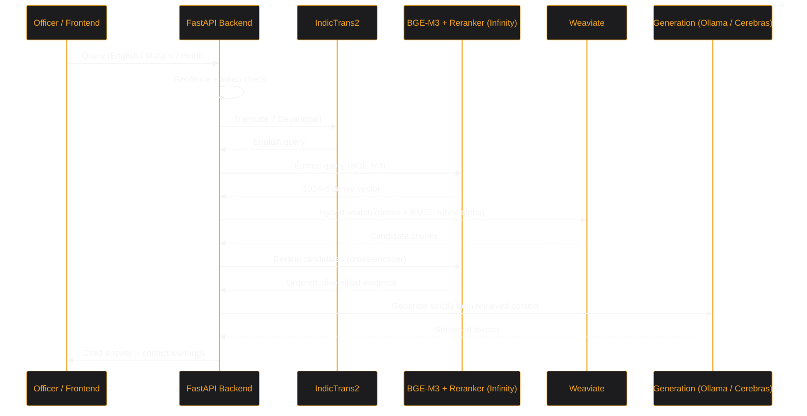

<div align="center">
  
</div>

# Mimir Engine

Mimir is an **extensible, citation-backed RAG engine** for government policy documents, built to run on infrastructure a department controls.

The repository ships a reference implementation — an Officer Portal for the Higher & Technical Education Department, Government of Maharashtra — but the engine is department-agnostic. Pointing `CORPUS_COLLECTION` at a different Weaviate collection is enough to serve Finance, Health, or Revenue with no backend code change.

Named after the Norse figure who guarded the Well of Wisdom.

**[`DEPLOYMENT.md`](DEPLOYMENT.md)** is the operational manual: hardware tiers, distributed deployment, corpus loading, and the failure modes that have actually occurred. This file is the overview.

---

## What it does

- **Runs on your own hardware.** `DEPLOYMENT_MODE=sovereign` puts generation, embeddings, reranking, translation and OCR on machines you control. Every model in that path is open-weight, so an air-gapped deployment is a configuration change rather than a rewrite.

- **Hybrid retrieval.** Dense vectors and BM25, fused natively in Weaviate with an alpha weight tuned per query — GR-number lookups lean keyword-heavy, conceptual questions stay balanced. **BGE-M3** embeddings (1024-d, multilingual) and a **BGE cross-encoder reranker**, both served from one self-hosted Infinity instance.

- **Multilingual by design.** Marathi and Hindi queries are detected and translated to English by a self-hosted **IndicTrans2** service before retrieval, so both halves of hybrid search keep working against a single index. Ingestion uses the larger 1B model, where accuracy on legal phrasing outweighs latency.

- **Conflict and supersession awareness.** When retrieved documents disagree on an amount, age, date or threshold, the answer opens with a warning naming both values and which is operative. An officer acting on a superseded figure is the specific failure this system exists to prevent.

- **Idempotent ingestion.** SHA-256 file-hash tracking makes re-ingestion a no-op. PDF extraction degrades through three tiers (PyMuPDF4LLM → Docling or Document AI OCR → Gemini Vision) so scanned circulars still index. Chunking is table-aware and preserves a parent-child hierarchy.

- **Security and auditability.** Intranet geofencing ahead of authentication; SHA-256 token identity with no passwords; an append-only access log; and an upload quarantine that keeps uploaded documents out of retrieval until an administrator promotes them.

- **Operational visibility.** The admin console reports live component topology, effective configuration, query volume, refusal rate, latency percentiles, most-cited documents, and a ranked list of questions the corpus could not answer.

---

## Architecture

### Query flow



### Logical components

Ingestion and retrieval are separate pipelines sharing the same three services, which is why a document is indexed with exactly the model that will later search it.


Deployment topology — one instance per service in a single VPC, with only the application publicly addressable — is documented in [`DEPLOYMENT.md`](DEPLOYMENT.md).

---

## Deployment modes

`DEPLOYMENT_MODE` sets the default for four independent provider switches, each still overridable on its own.

| Switch | `sovereign` | `hybrid` |
|---|---|---|
| `GEN_PROVIDER` | `local` (Ollama) | `cerebras` |
| `PDF_PARSE_TIER2_PROVIDER` | `docling` | `docai` |
| `INGEST_STRUCTURE_PROVIDER` | `local` | `gemini` |
| `INGEST_TRANSLATE_PROVIDER` | `indictrans2` | `gcp` |

In `sovereign` mode no query text leaves the network at inference time. Everything that reads the corpus is self-hosted either way — only the final generation step differs, which is what makes the switch a configuration change rather than a migration. The admin console's Deployment panel shows the configuration actually in force, resolved at runtime rather than assumed.


---

## Deploying

On a machine with Docker and nothing else configured, the whole stack is one command:

```bash
git clone https://github.com/pushkqr/mimir.git && cd mimir && python deploy.py up
```

`up` writes any missing `.env` files first, then starts everything in order. The individual steps:

```bash
python deploy.py init                # write every .env: derived URLs, generated secrets
python deploy.py check               # prerequisites, hardware report, per-service readiness
python deploy.py up                  # every service in order, then the app
python deploy.py up --only weaviate  # just one service
python deploy.py status              # live reachability, same probes as the admin panel
python deploy.py config              # required values, values that must agree, what services report
python deploy.py logs weaviate       # follow one service's container logs
python deploy.py down                # tear down, reverse order
```

`check` asks whether services *can* start, `status` whether they *are* reachable, and `config` whether what they were told is *coherent*. A stack can pass the first two and still be misconfigured in ways that only surface under real traffic.

`deploy.py` never reimplements a service's startup logic — it shells out to the `deploy.py` each service directory carries, so the single-machine and distributed paths cannot drift.

### Services

Every directory under `microservices/` is standalone and stdlib-only. Copy one to a machine that has never seen this repository and it will still deploy.

| Service | Port | Runs |
|---|---|---|
| `microservices/weaviate` | 8080, 50051 | Weaviate vector store |
| `microservices/embeddings` | 7997 | BGE-M3 and the cross-encoder reranker via Infinity |
| `microservices/translation` | 8001 | IndicTrans2 (200M for queries, 1B for ingestion) |
| `microservices/generation` | 11500 | Ollama; model tier chosen from detected hardware |
| `microservices/docling` | 8002 | Docling PDF OCR |

Compose files publish on `127.0.0.1` only, which is right for one machine and wrong for several — change the binding on any service reached from another host, and only where the network is trusted.

The embedding model is deliberately **not** configurable: every stored vector is 1024-dimensional, and changing the model makes the existing index unreadable without a full re-ingest.

---

## Installation

| Dependency | Purpose |
|---|---|
| Python 3.10+ | Core runtime |
| Docker | Every service ships as a compose file |
| Node 18+ | Frontend stylesheet build only — not needed at runtime |
| HuggingFace account with IndicTrans2 access | Both translation checkpoints are gated |
| Google Cloud project | Ingestion only: Document AI OCR and Cloud Translation in `hybrid` mode, plus the tier-3 Gemini Vision fallback, which is **not** gated by `DEPLOYMENT_MODE` |
| Cerebras API key | `hybrid` mode generation only |

```bash
git clone https://github.com/pushkqr/mimir.git && cd mimir
python -m venv .venv && source .venv/bin/activate   # Windows: .venv\Scripts\activate
pip install -r requirements.txt
cp .env.example .env                                 # then fill it in
python deploy.py check && python deploy.py up
```

### Configuration essentials

```env
DEPLOYMENT_MODE=sovereign

WEAVIATE_URL=http://<weaviate-host>
WEAVIATE_GRPC_PORT=50051
WEAVIATE_API_KEY=...
CORPUS_COLLECTION=GovDocsV2

LOCAL_EMBED_URL=http://<embed-host>:7997/embeddings
LOCAL_RERANK_URL=http://<embed-host>:7997/rerank
LOCAL_EMBED_API_KEY=...
LOCAL_EMBED_MODEL_NAME=BAAI/bge-m3
LOCAL_RERANK_MODEL_NAME=BAAI/bge-reranker-v2-m3
EMBED_BATCH_SIZE=64
LOCAL_EMBED_BATCH_TIMEOUT_S=60

LOCAL_GEN_URL=http://<generation-host>:11500/v1
LOCAL_GEN_MODEL=qwen3:4b

TRANSLATION_SERVICE_URL=http://<translation-host>:8001/translate
INGEST_TRANSLATION_SERVICE_URL=http://<ingest-translation-host>:8001/translate

MIMIR_AUTH_TOKEN=...
MIMIR_ADMIN_TOKEN=...
MIMIR_ALLOWED_SUBNETS=10.0.0.0/8        # 0.0.0.0/0 only for a public demo
```

`EMBED_BATCH_SIZE` and `LOCAL_EMBED_BATCH_TIMEOUT_S` are worth tuning to your hardware. On a CPU-only embedding node, long passages embed slowly enough that a large batch can exceed the timeout; smaller batches with a longer timeout are the safer combination.

> **Officer tokens** are issued from the admin console, and each is scoped to one department (or to the `ALL` sentinel for cross-department access). `MIMIR_SEED_DEMO_TOKENS=true` seeds two fixed development tokens whose values are public in this source — never set it on anything reachable from outside your machine.

---

## Frontend

`templates/` holds four pages of vanilla HTML, CSS and JavaScript with no framework and no build step for the markup itself: `landing.html`, `login.html`, `portal.html` (officer interface) and `admin.html` (administrator console).

Styling is the one part that is compiled. `assets/app.css` is a prebuilt Tailwind bundle, and the webfonts and the graph library are vendored under `assets/`. Nothing is fetched from a CDN at runtime, so the interface renders correctly on a filtered, slow or air-gapped network — previously a blocked CDN meant the pages rendered as unstyled HTML.

`assets/app.css` is committed, so **runtime needs no Node**. Rebuild it only after changing markup, since Tailwind emits just the classes it can see:

```bash
npm install                                                               # first time only
npx @tailwindcss/cli -i assets/tailwind.src.css -o assets/app.css --minify
```

---

## Usage

```bash
uvicorn app:app --reload
```

`/` is the landing page, `/portal` the officer interface, `/admin` the administrator console.

### Ingesting documents

Place PDFs in `docs/` and Orgpedia plaintext GRs alongside them, then set the flags in `main.py` (`RUN_INGESTION = True`) and run `python main.py`. For a full department corpus, use the bulk path, which tracks state separately and can resume:

```bash
python -m scratch.ingest_department --full
```

Ingestion is idempotent — re-running with unchanged files is a no-op, since files are skipped on SHA-256 hash.

---

## Repository layout

```text
mimir/
├── app.py              # FastAPI server: geofence + auth gate, SSE endpoints, admin API
├── main.py             # CLI entry point (ingestion, retrieval, benchmark)
├── db.py               # SQLite: tokens, history, audit log, feedback, query log
├── deploy.py           # Stack orchestrator (delegates to each service's own deploy.py)
│
├── core/               # utils, embedding, schema, deployment (mode resolution),
│                       # health (shared probes), outcome, config_check, log_config
├── ingestion/          # pipeline (PDF), text_ingestion, pdf_transform, chunking,
│                       # parsers (three-tier extraction), metadata, state (hash tracking)
├── retrieval/          # pipeline, search (hybrid + alpha + rerank), query, graph, support
│
├── microservices/      # weaviate/ embeddings/ translation/ generation/ docling/
│                       # each standalone: deploy.py + docker-compose.yml + .env.example
│
├── templates/          # landing, login, portal, admin — vanilla HTML/JS
├── assets/             # app.css (built), tailwind.src.css, fonts/, vendor/, logos
│
├── benchmark/          # runner (execution + dual grading), evaluation (scorer + judge)
├── learning/           # architecture and design write-ups
├── tests/              # stdlib unittest suite
└── scratch/            # regress.py, ingest_department.py, loadtest.py, maintenance scripts
```

---

## Testing

The regression suite is the one that carries weight. It runs the demo queries against a live stack and asserts on answer *content* rather than latency, so it catches quality regressions a timing check would sail past:

```bash
python -m scratch.regress
```

It spaces queries to respect the Cerebras rate limit. Lowering that spacing trips the limit, and since generation fails closed there is nothing to absorb it — the case reports an error rather than a slower answer.

```bash
python -m unittest discover -s tests -v
```

> The `tests/` suite needs no extra dependency, but it has drifted behind the modules it covers and does not exercise the microservices split, deployment modes, or the admin API. Treat it as partial coverage, not a gate. Bringing it back in line is outstanding work.

---

## Evaluation

`benchmark/` holds a dual-graded harness. A deterministic scorer checks that required terms (GR numbers, dates, counts) actually appear, and an LLM judge scores factual accuracy against a human-verified answer. A case passes on `judge >= 3.0`, or `judge >= 2.0` with `term >= 0.5`.

Term matching alone is too rigid and a judge alone is too lenient about missing specifics. Using only half of the pair once produced a confidently wrong conclusion about disabling reranking, which is why both are kept.

```bash
python benchmark/runner.py
```

> The most recent published result — **88/100**, judge average 4.13 — was measured against a **533-document** corpus. The deployed corpus is now roughly **104,000 documents and 790,000 indexed sections across 33 departments**, some two hundred times larger. That figure demonstrates the harness works; it is **not** a current score, and a corpus of this size changes retrieval difficulty in both directions — more documents that could answer a question, and more near-duplicates to confuse it. Re-running is the only way to know.

---

## Disclaimer

Mimir is designed for administrative decision support. While it prioritises strict retrieval-based grounding with source citations, always verify outputs against official published government circulars and gazette notifications before taking administrative action.
