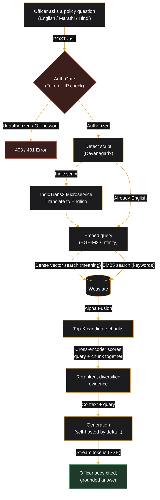

# 00 — Overview: The Whole Pipeline in One Map

**In one line:** An officer asks a policy question in English, Marathi, or Hindi — the system translates it if needed, searches a hybrid index of thousands of government circulars, and streams back a grounded, cited answer.

---

## ELI10 — the analogy

Imagine a massive, heavily guarded **Library of Official Government Rules**, staffed by a multi-lingual librarian.

1. **The Security Guard:** When you walk up, a guard checks your badge (`MIMIR_AUTH_TOKEN`) and confirms you're on the government intranet. Public networks are turned away at the gate.
2. **The Translator:** If you ask your question in Marathi or Hindi, the librarian's assistant quietly translates it to English before searching — because the index works best in English.
3. **The Card Catalog:** The librarian uses a dual-index system — one index searches for exact words (great for GR numbers like "MUWAD-2016/(38/16)"), the other searches for *meaning* (great for vague queries like "temporary post extensions"). Both results are fused together.
4. **The Final Report:** The librarian reads the top matching pages, writes a clean cited answer, and hands it back — with a confidence-scored chip linking directly to the exact circular so you can verify it yourself.

That is the entire architecture of Mimir.

---

## The real pipeline

---

## The five stages, in plain words

1. **Auth Middleware.** Every request (except the public landing page) is checked against `MIMIR_AUTH_TOKEN` and the client IP is validated against authorized government subnets. Requests from public networks die here. See [02-security-and-auth.md](02-security-and-auth.md).

2. **Indic Language Detection & Translation.** The system detects Devanagari script in the query. If found, it calls the self-hosted **IndicTrans2** microservice to translate Marathi/Hindi → English before embedding. This happens transparently — the officer never needs to type in English.

3. **Hybrid Search (Dense + Sparse).** We embed the (now English) query using **BGE-M3** (a self-hosted multilingual embedding model) and fire off two searches in Weaviate simultaneously — a dense vector search (for meaning) and a BM25 keyword search (for exact GR numbers and terminology). Alpha Fusion merges them. See [01-hybrid-retrieval.md](01-hybrid-retrieval.md).

4. **Reranking.** The first search compared query and chunk *separately*, since each was embedded on its own. A cross-encoder now reads them *together*, which is more accurate and much slower, so it runs only over the shortlist. Results are then capped per document, because five chunks from one circular repeating a detail read to the model as strong corroboration even when that circular is the wrong one.

5. **Generation.** The retrieved chunks go into a prompt that instructs the model to answer *only* from what it was given, and to open with an explicit warning when two documents disagree on a figure. By default this runs on **Ollama** on the department's own hardware. `DEPLOYMENT_MODE=hybrid` swaps in **Cerebras** and **Gemini 2.5 Flash** where third-party inference is acceptable. Every model in the self-hosted path is open-weight, so nothing proprietary is load-bearing.

**How do we know it works?** Not a stage, but the thing that keeps the five above honest: an automated harness runs a curated set of hard policy questions — simple English, Marathi queries, complex synthesis, GR number lookups, and intentional "not found" cases — grading each on both term-match and semantic accuracy. See [03-benchmark-and-evaluation.md](03-benchmark-and-evaluation.md).

---

## Why it matters

- **It's multilingual by design.** Maharashtra government documents are in Marathi. Officers think in Marathi. The system handles this natively without requiring officers to translate their own questions.
- **It's honest.** We don't claim zero hallucinations through magic. We achieve it through strict retrieval-grounded prompting and a benchmark suite that catches regressions quantitatively.
- **It's self-sufficient.** Embeddings, reranking, translation, document parsing and generation all run on machines the department controls. No cloud quota limits, no per-query cost at runtime, and in sovereign mode no query text leaves the network at all. Every model in that path is open-weight, so moving on-premise is a configuration change rather than a rewrite.
